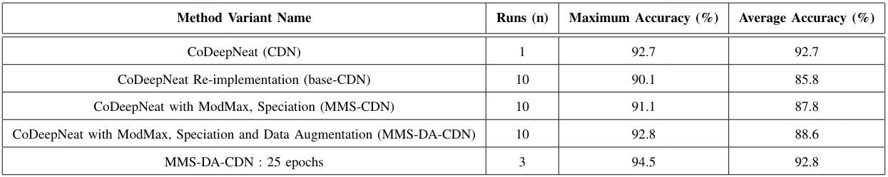
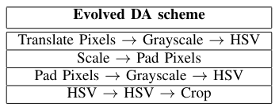
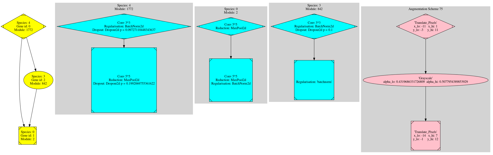
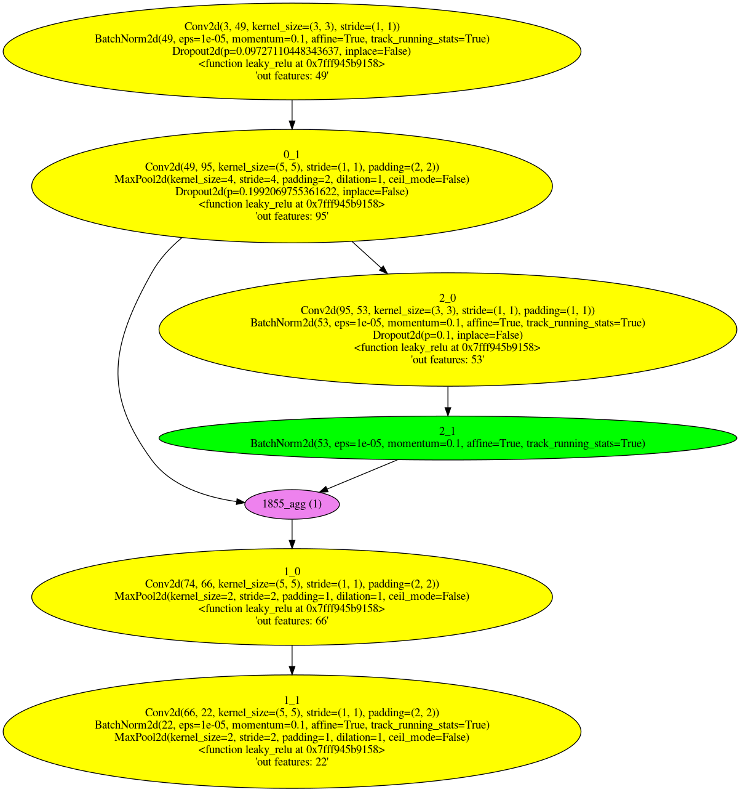

# CoDeepNEAT

An implementation of implementation of CoDeepNEAT, originally created by Risto Miikkulainen et al. with our own extensions. Implementation details were taken from their [2017](https://arxiv.org/pdf/1703.00548/) and [2019](https://arxiv.org/pdf/1902.06827.pdf) paper.

## Setup
Requires [conda](https://docs.conda.io/en/latest/) 
```
conda create -n cdn --file requirements.txt
conda activate cdn
pip install tarjan wandb  # these are not available from conda
```  

## Entry points
Directory: ```src/main/```  
```ft.py``` Fully trains a run from evo.py  
```evo.py``` Does an evolutionary run  
```batch_run.py``` Running many different configurations all the way from evolution to fully training. (See note below)  

## Config
All config options are in ```src/configuration/configuration.py```  
Example configs are in ```src/configuration/configs``` directory  

## How to run
```python src/main/evo.py -g 1 -c base```

## Extensions
Extensions are detailed in the paper linked above

# Paper

If you use this code, please cite [our paper](https://ieeexplore.ieee.org/abstract/document/9308151):

```
@INPROCEEDINGS{9308151,
  author={S. {Acton} and S. {Abramowitz} and L. {Toledo} and G. {Nitschke}},
  booktitle={2020 IEEE Symposium Series on Computational Intelligence (SSCI)}, 
  title={Efficiently Coevolving Deep Neural Networks and Data Augmentations}, 
  year={2020},
  volume={},
  number={},
  pages={2543-2550},
  doi={10.1109/SSCI47803.2020.9308151}}
```

## Results
For detailed results see:  
[convergence](https://app.wandb.ai/codeepneat/cdn_fully_train/reports/CoDeepNEAT-convergence-results--VmlldzoyMTIyMjY?accessToken=86xwfnm0f8tko6spt71oharczveqgv388hzojcuei7g3z4wonshr4uy5n24bbga6)  
[evolution](https://app.wandb.ai/codeepneat/cdn/reports/CoDeepNEAT-evolution-results--VmlldzoyMTIyNDI?accessToken=bvjugcdbb1qdgn7czmcyxct60cxkgatapk8nldg1bt7gwy4a4kovlavdt5sy7bz5)

The accuracies obtained on CIFAR-10  


The best data augmentations found  


The best genotype found. Using config `configuration/configs/experiments/mms_da_pop_25e.json` and a feature multiplier of 5    


And its corresponding phenotype



#### Note about batch runs
This system was developed for rapid tuning of CDN's own hyperparameters on a cluster with a limited number of GPUs. It should not be used for normal training as it was created for our very specific case. Rather do a single run on ```evo.py``` and then fully train it with ```ft.py```.
